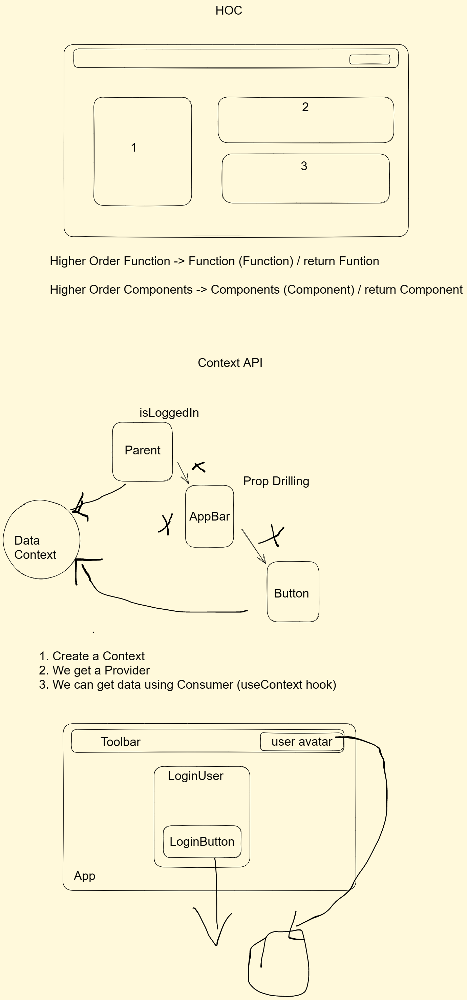

# Concepts

## HOC

### Steps

1. Create a component
2. Create a HOC, which takes a component as an argument and returns a component
3. Wrap the component with the HOC

## Context

### Steps

1. Create a context file
2. Create a content in the context file
3. Create a context provider
4. Wrap the app with the context provider
5. Consume the context in the component where you want to use it

## HTTP Request

### Steps

1.

