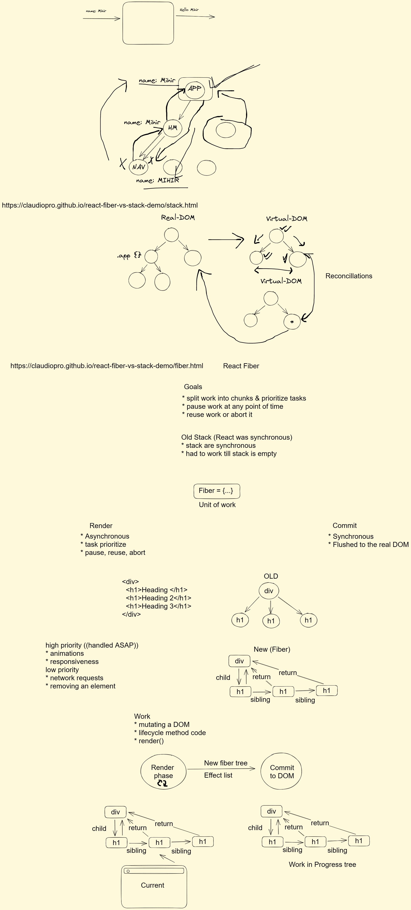

# React - 15 & 16 Series Notes

## Day 15 - Advanced React

Worked on the following topics:

1. Pure/Impure Components
2. How is React Unidirectional
3. Virtual DOM
4. Hooks behind the scenes
5. Lazy Loading components
6. SPAs & MPAs

## Day 16 - React Fiber & Interview Questions

Worked on the following topics:

1. React Fiber
2. Interview Questions

* What are the component?
* How is React Unidirectional?
* Explain all the variations of useEffect.
* Context API and why?
* Controlled Component and Uncontrolled components
* What's new in React 18?
* What is a Pure Component?
* Why is the functional component approach better?
* useMemo vs useCallback?
* useMemo vs React.memo
* Why don't we just memoize everything?
* Lazy loading, Suspense
* Why do we need to transpile React code?
* What is the significance of keys in React?
* What is the significance of refs in React?
* What is the StrictMode component and why would you use it?

### Links

* [React Fiber vs old conciliation approach with Stack](https://claudiopro.github.io/react-fiber-vs-stack-demo/)
* <https://github.com/facebook/react/blob/main/packages/react-reconciler/src/ReactInternalTypes.js#L49>
* <https://github.com/facebook/react/blob/main/packages/react-reconciler/src/ReactWorkTags.js>
